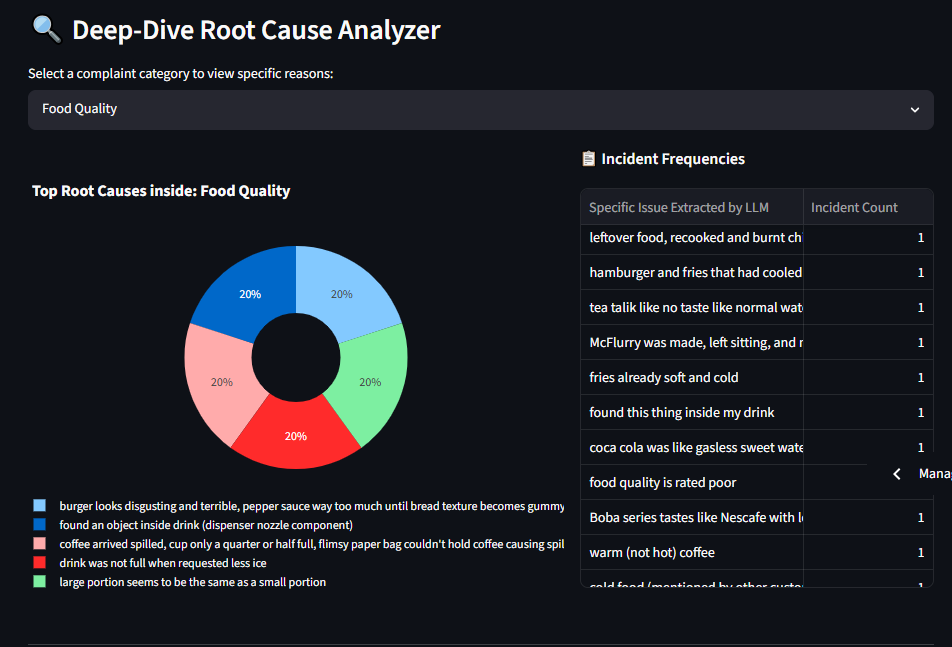
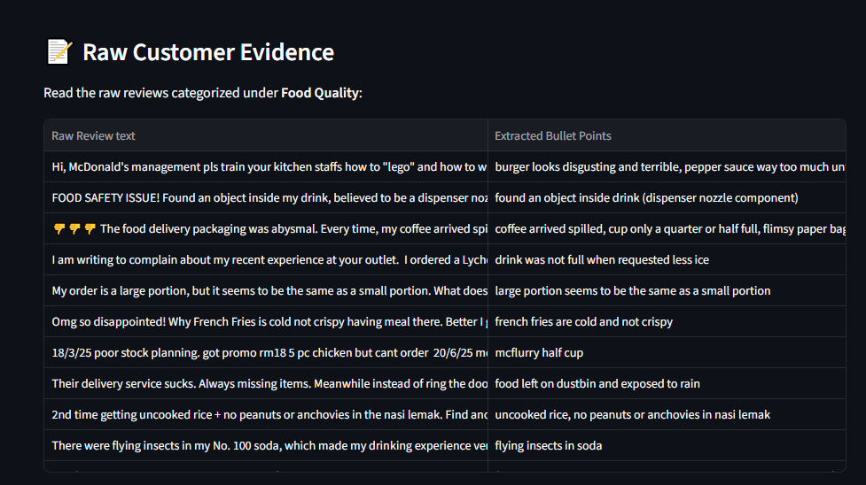

# FastFood-LLM-reviews-analytics

An AI-powered fast food review analytics system that uses **Google Gemini 2.5 Flash API** to perform **multi-label classification** on customer reviews. The system extracts insights from raw text reviews and visualizes them through an interactive **Streamlit dashboard**.

Streamlit App ： (https://fnb-llm-reviews-analytics.streamlit.app/)

---

## 1. Overview
Customer reviews often contain multiple sentiments and topics in a single sentence (e.g., food quality, service, cleanliness). Traditional single-label sentiment analysis fails to capture this complexity.

This project uses a **Large Language Model (Gemini 2.5 Flash)** to:
- Understand review context
- Assign multiple custom-defined labels per review
- Enable deeper business insights through visualization

The results are displayed in a **Streamlit-based dashboard** for easy exploration.

### Features
- Multi-label classification using Gemini API
- LLM-based semantic understanding of informal and mixed-language reviews (including Malaysian rojak language)
- Interactive Streamlit dashboard
- Label distribution analytics & insights
- Deployable on Streamlit Community Cloud

## 2. Problem Statement
Customer reviews in the fast food industry are often unstructured and contain multiple sentiments or topics within a single text. However, conventional NLP approaches typically assign only one label per review, leading to loss of information. 

This project leverages Google Gemini 2.5 Flash to perform LLM-based multi-label classification, enabling more granular extraction of insights and improving the interpretability of customer feedback through structured labels and visualization.

## 3. Objectives
- To develop an NLP-based system for analyzing fast food customer reviews
- To apply Google Gemini 2.5 Flash for multi-label classification of unstructured text data
- To enable extraction of multiple semantic aspects from a single review (e.g., food quality, service, pricing)
- To transform raw text into structured insights for business analysis
- To build an interactive Streamlit dashboard for data exploration and visualization

## 4. Datasets
The dataset used in this project consists of customer reviews collected from Google Maps for three fast food brands: **McDonald’s**, **KFC**, and **Burger King**.

To ensure geographical diversity and more realistic customer behavior analysis, reviews were collected across five different locations in Malaysia:
- Cyberjaya
- Puchong
- Sepang
- Setapak
- Subang Jaya
  
Each brand contains review data from all five locations, allowing comparisons across both brand-level and location-level perspectives.

### A) Data Collection Method

The data was collected using the **Apify Google Maps Reviews Scraper** (https://apify.com/compass/google-maps-reviews-scraper):

This tool was used to extract structured review data directly from Google Maps listings, including:
- Review text
- Star ratings
- Reviewer metadata (if available)
- Timestamp of review
- Location / place information

### B) Dataset Structure
After preprocessing, the dataset contains:

- brand → McDonald’s/KFC/Burger King
- branch_name → Specific outlet name
- address → Full Google Maps address
- city → Location area (Subang Jaya, Puchong, etc.)
- clean_text → Review text from Google Maps
- clean_language → Detected language (English / Malay / Chinese / Rojak)
- review_id → Unique identifier 
- review_length → Length of review text
- labels → Multi-label output from Gemini

### C) Data Filtering Strategy
This project focuses exclusively on **negative reviews** to analyze customer complaints and pain points.

The filtering process is defined as follows:
- Star ratings of 1 and 2 are mapped as negative reviews
- Only negative reviews are retained
- Sentiment and rating columns are removed after filtering

## 5. System Workflow
**i) Data Collection**
- Reviews scraped from Google Maps using Apify
- Stored in structured CSV format

**ii) Preprocessing**
- Text cleaning and normalization
- Language detection (English, Malay, Chinese, rojak)
- Removal of noise and duplicates
- Filtering: only negative reviews reta

**iii) LLM-Based Multi-Label Classification (Gemini 2.5 Flash)**
- Each review is passed into Gemini API
- Prompt engineered for structured multi-label output
- Model returns multiple aspect labels per review
  
**iv) Post-processing**
- Convert LLM output into structured DataFrame
- Aggregate label statistics
  
**v) Visualization (Streamlit Dashboard)**
- Label distribution charts
- Review filtering by labels
- Insights breakdown

## 6. Technologies Used
- Python
- Google Gemini API (2.5 Flash)
- Streamlit
- Pandas 
- NumPy
- Plotly 
- Prompt engineering (LLM prompting logic)

## 7. Evaluation Methodology

### A) Evaluation Dataset

To evaluate the performance of the multi-label classification system, a subset of **150 customer reviews** was randomly selected from the full dataset. The sample includes reviews of varying lengths to ensure representation of both short and detailed customer feedback.

Each review was manually annotated according to the predefined label taxonomy, creating a ground truth dataset for evaluation. The same reviews were then processed by **Google Gemini 2.5 Flash**, and the predicted labels were compared against the manually assigned labels.

### B) Evaluation Metrics

The following multi-label classification metrics were used:
- **F1-Score (Per Label)** – Measures the balance between precision and recall for each individual label.
- **Hamming Loss** – Measures the fraction of incorrectly predicted labels relative to the total number of labels.
- **Subset Accuracy** – Measures the percentage of reviews where the entire set of predicted labels exactly matches the ground truth labels.

These metrics provide both label-level and instance-level evaluation of the model's performance.

## 8. Ground Truth Dataset & Results

### A) Ground Truth Label Taxonomy
The manually annotated dataset uses the following labels:
- Food Quality
- Order Accuracy
- Staff Professionalism
- Speed of Service
- Hygiene and Cleaness
- Facility Equipment
- Product Availability
- No Specific Complaint

### B) Evaluation Results

### C) Overall Metrics

## 9. How to use the app

1) Start the application using Streamlit (https://fnb-llm-reviews-analytics.streamlit.app/)
2) Select your desired filter options, such as:
  - Brand (McDonald’s, KFC, Burger King)
  - City (Subang Jaya, Puchong, Sepang, Cyberjaya, Setapak)
  - Or a combination of both
  
3) The system will automatically generate an interactive dashboard based on your selection, including:
  - Label distribution
  - Review insights

## 10. Output

A) As shown in Diagram 1, users can choose a specific brand and city using the sidebar filter controls. Once selected, the dashboard instantly updates to display the corresponding analytics, breaking down total negative reviews into actionable and general complaints.

  <b> Diagram 1 </b>

B) From Diagram 2 , we can see that this section displays a horizontal bar chart that breaks down operational complaints by percentage. It allows users to clearly see which specific categories—such as staff professionalism, speed of service, or food quality—contribute most to customer dissatisfaction based on the selected brand's filters.

 <b> Diagram 2 </b> 

C) As shown in Diagram 3, users can select a specific complaint category from the dropdown menu to investigate issues more deeply. The dashboard instantly displays a donut chart of the top root causes alongside a detailed list of incident frequencies, highlighting specific customer feedback extracted by the system.

 <b> Diagram 3 </b> 

D) From Diagram 4 , we can see that  section provides transparency by displaying a side-by-side table of raw customer feedback categorized under the selected issue type. It maps the original user-submitted review text directly to the key bullet points extracted by the system, allowing users to verify the exact context behind each logged complaint.

 <b> Diagram 4 </b> 

## 11. Future Improvements

**Standardization of Complaint Issues**

Currently, the system is capable of assigning multiple labels to customer reviews using Gemini 2.5 Flash. However, the extracted complaints within each label remain in free-text form and may vary in wording despite referring to the same underlying issue.

For example:
- "Food was cold"
- "Burger not hot"
- "Fries arrived cold"

All represent a similar complaint (Food Temperatues) but are expressed differently.

Future work will focus on developing a complaint standardization pipeline to normalize semantically similar feedback into predefined issue categories. This will enable:
- More accurate aggregation of recurring customer complaints
- Better trend analysis across brands and locations
- Easier identification of root causes
- More actionable business insights
